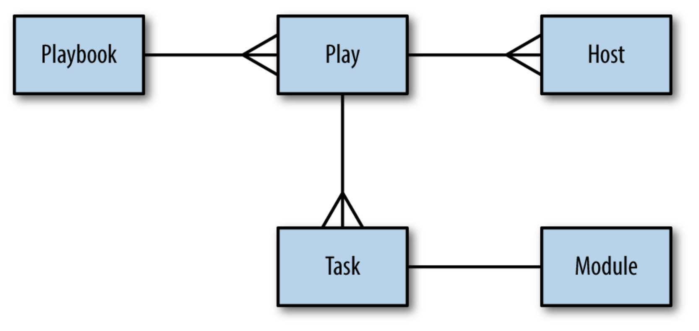

## Now the Ansible part...

### What do you need?

Ansible and a test-server. As mentioned before, you can use Docker, VM's and so on... I will use `vagrant` and this is how I set it up.
```
→ vagrant init ubuntu/trusty64
...

→ vagrant up
...

→ vagrant ssh
...

→ vagrant ssh-config
Host default
  HostName 127.0.0.1
  User vagrant
  Port 2222
  UserKnownHostsFile /dev/null
  StrictHostKeyChecking no
  PasswordAuthentication no
  ...
```

### Basic Ansible
To test your Ansible connection to the machine you must create a `hosts` file with `ibm-test-server ansible_host=127.0.0.1 ansible_port=2222 ansible_user=vagrant ansible_private_key_file=../.vagrant/machines/default/virtualbox/private_key` and then you can proceed:

```
→ ansible ibm-test-server -i hosts -m ping

ibm-test-server | SUCCESS => {
    "changed": false,
    "ping": "pong"
}
```
The `"changed": false` message is a important one... it means that our interaction didn't change the state of the server connected to.

However, to continue editing this `hosts` file is quite annoying.. and referring to it as well, doesn't make sense. That is why we can create `./ansible.cfg`:
```
[defaults]
inventory = hosts
remote_user = vagrant
private_key_file = ../.vagrant/machines/default/virtualbox/private_key
host_key_checking = False
```

> disabling host-key checking it is just convenient when using vagrant. Otherwise I need to change `~/.ssh/know_hosts` every time I a recreate a machine.

This will make it easier now as we can change the hosts file to only `ibm-test-server ansible_host=127.0.0.1 ansible_port=2222`.

```
→ ansible ibm-test-server -m ping
...

→ ansible ibm-test-server -m command -a uptime
ibm-test-server | SUCCESS | rc=0 >>
 12:31:37 up 27 min,  1 user,  load average: 0.00, 0.01, 0.05
```

The `-a` flag is an argumment flag, on this case an argument to command - just like a SSH command. The `command` module is the default one, so we could just:

```
→ ansible ibm-test-server -a uptime

ibm-test-server | SUCCESS | rc=0 >>
 12:34:16 up 30 min,  1 user,  load average: 0.00, 0.01, 0.05

→ ansible ibm-test-server -a "ls /var/log"
...

→ ansible ibm-test-server -a "tail /var/log/syslog"

ibm-test-server | FAILED | rc=1 >>
tail: cannot open '/var/log/syslog' for reading: Permission deniednon-zero return code

→ ansible ibm-test-server -b -a "tail /var/log/syslog"

ibm-test-server | SUCCESS | rc=0 >>
Jun 15 12:31:37 vagrant-ubuntu-trusty-64 ansible-command: Invoked with creates=None executable=None _uses_shell=False _raw_params=uptime removes=None warn=Truechdir=None stdin=None
...
```

You can always do more than checking stuff and running `uptime`. You can install Nginx on this Ubuntu machine by:

```
→ ansible ibm-test-server -b -m apt -a "name=nginx update_cache=yes"

ibm-test-server | SUCCESS => {
    "cache_update_time": 1529012944,
    "cache_updated": false,
    "changed": true,
    "stderr": "",
    "stderr_lines": [],
    "stdout": "Reading package lists...
    ...
```

To restart Nginx:
```
→ ansible ibm-test-server -b -m service -a "name=nginx state=restarted"

ibm-test-server | SUCCESS => {
    "changed": true,
    "name": "nginx",
    "state": "started"
}
```

### A quick look into playbooks
Let's make sure that our vagrant machine can expose port 80 and 443.

```
VAGRANTFILE_API_VERSION = "2"

Vagrant.configure(VAGRANTFILE_API_VERSION) do |config|
  config.vm.box = "ubuntu/trusty64"
  config.vm.network "forwarded_port", guest: 80, host: 8080
  config.vm.network "forwarded_port", guest: 443, host: 8443
end
```

```
→ vagrant reload
==> default: Attempting graceful shutdown of VM...
==> default: Checking if box 'ubuntu/trusty64' is up to date...
==> default: Clearing any previously set forwarded ports...
==> default: Clearing any previously set network interfaces...
==> default: Preparing network interfaces based on configuration...
    default: Adapter 1: nat
==> default: Forwarding ports...
    default: 80 (guest) => 8080 (host) (adapter 1)
    default: 443 (guest) => 8443 (host) (adapter 1)
    default: 22 (guest) => 2222 (host) (adapter 1)
    ...
```
Let's first take a look into the `files/nginx.conf` and `templates/index.html.j2`.

Now let's add something to `hosts`, a new group:
```
[webservers]
testserver ansible_host=127.0.0.1 ansible_port=2222
```

Now let's take a look at an `ansible-playbook`. A playbook is a sequence of commands and configurations that you perform in a server / group of servers. Check `simple-web.yml`.

Every play (like `simple-web-yml`) must contain:
- _hosts_
- a list of _tasks_ to be performed on the _hosts_

We already saw the `-m` flag when doing ansible on the CLI. That refers to a module which are scripts that come packaged with Ansible to perform a specific action on a host. On this playbook we use `apt copy file template service`... Ansible comes packaged with hundreads of modules, you can also use third-party ones or develop your own!




```
→ ansible-playbook simple-web.yml

PLAY [Configure webserver with nginx] **************************************************************************************************************************

TASK [Gathering Facts] *****************************************************************************************************************************************
ok: [ibm-test-server]

TASK [install nginx] *******************************************************************************************************************************************
ok: [ibm-test-server]

TASK [copy nginx config file] **********************************************************************************************************************************
changed: [ibm-test-server]

TASK [enable configuration] ************************************************************************************************************************************
ok: [ibm-test-server]

TASK [copy index.html] *****************************************************************************************************************************************
changed: [ibm-test-server]

TASK [restart nginx] *******************************************************************************************************************************************
changed: [ibm-test-server]

PLAY RECAP *****************************************************************************************************************************************************
ibm-test-server            : ok=6    changed=3    unreachable=0    failed=0

```

Now you can do one thing... go to http://localhost:8080. :-)

Before we move on to something more complex, let's deploy this same nginx over a TLS certificate and introduce the concept of `handler` and `notify`.

### Going a bit deeper
Let's build this same server now with a TLS certificate. Of course I am not reaching out to a CA and buy one... Ansible supports `letsencrypt`. Let's generate a TLS certificate and key in our `files` folder:

```bash
openssl req -x509 -nodes -days 365 -newkey rsa:2048 -subj /CN=localhost -keyout files/nginx.key -out files/nginx.crt
```

Let's now look into the playbook and the `nginx.template`.

After that, we can run the playbook.

```
→ ansible-playbook simple-web-tls.yml

PLAY [Configure webserver with nginx and tls] ******************************************************************************************************************

TASK [Gathering Facts] *****************************************************************************************************************************************
ok: [ibm-test-server]

TASK [Install nginx] *******************************************************************************************************************************************
ok: [ibm-test-server]

TASK [create directories for ssl certificates] *****************************************************************************************************************
changed: [ibm-test-server]

TASK [copy TLS key] ********************************************************************************************************************************************
changed: [ibm-test-server]

TASK [copy TLS certificate] ************************************************************************************************************************************
changed: [ibm-test-server]

TASK [copy nginx config file] **********************************************************************************************************************************
changed: [ibm-test-server]

TASK [enable configuration] ************************************************************************************************************************************
ok: [ibm-test-server]

TASK [copy index.html] *****************************************************************************************************************************************
ok: [ibm-test-server]

RUNNING HANDLER [restart nginx] ********************************************************************************************************************************
changed: [ibm-test-server]

PLAY RECAP *****************************************************************************************************************************************************
ibm-test-server            : ok=9    changed=5    unreachable=0    failed=0
```

Bam! Done! Now you can go to https://localhost:8443!

Now you know some basic Ansible and some fun stuff... let's move forward and deploy a more complex application on the second part!
